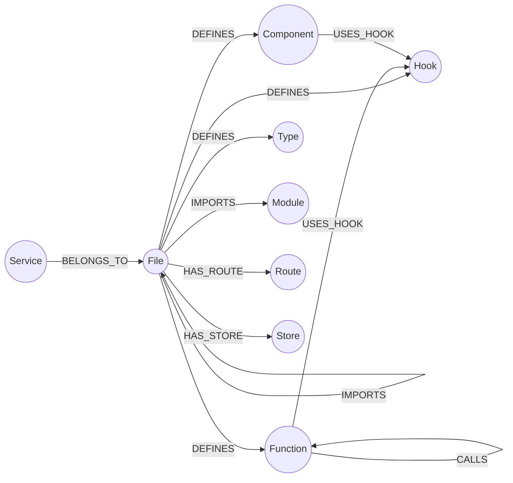

# Neo4j Dependency Graph Guide

AICA can build a comprehensive dependency graph of your codebase in Neo4j, enabling powerful queries across imports, function calls, component relationships, and more.

---

## Table of Contents

- [Overview](#overview)
- [Graph Schema](#graph-schema)
- [Setup](#setup)
  - [Local Docker](#local-docker)
  - [Neo4j Desktop](#neo4j-desktop)
  - [Neo4j Aura (Cloud)](#neo4j-aura-cloud)
- [Building the Graph](#building-the-graph)
- [Querying the Graph](#querying-the-graph)
- [Visualization](#visualization)
- [Troubleshooting](#troubleshooting)
- [Performance Notes](#performance-notes)

---

## Overview

The `aica build-graph` command transforms static code artifacts (from `scan-repo` and `index-code`) into a Neo4j graph database. This enables:

- **Dependency analysis** — trace import chains, find circular dependencies
- **Impact analysis** — identify all callers of a function, all components using a hook
- **Architecture visualization** — explore module boundaries, component hierarchies
- **Code navigation** — jump between definitions and usages
- **Refactoring support** — find all affected files before making changes

**Data flow:**

```
aica scan-repo → .repo_intelligence/*.json
aica index-code → .repo_intelligence/ast/*.json
aica build-graph → Neo4j graph database
```

---

## Graph Schema

### Node Types (9 total)

| Label       | Description                        | Key Properties                                     | Unique Constraint |
| ----------- | ---------------------------------- | -------------------------------------------------- | ----------------- |
| `File`      | Source files                       | `path` (repo-relative)                             | `path`            |
| `Function`  | Functions, arrows, methods         | `id` (file::name::line), `name`, `kind`, `async`   | `id`              |
| `Component` | React components                   | `id` (file::name), `name`, `kind`, `props[]`       | `id`              |
| `Hook`      | React hooks (custom + built-in)    | `name` (e.g. `useState`, `useIsMobile`)            | `name`            |
| `Type`      | TypeScript interfaces/type aliases | `name`, `kind`, `members[]`, `line`                | _(none)_          |
| `Module`    | External npm modules               | `name` (e.g. `react`, `next`)                      | `name`            |
| `Route`     | Next.js routes                     | `route` (e.g. `/api/users`), `type`, `methods[]`   | `route`           |
| `Service`   | Service modules                    | `name`, `file`                                     | _(none)_          |
| `Store`     | Zustand stores                     | `store` (name), `path`, `slices[]`, `middleware[]` | `store`           |

### Relationship Types (8 total)

| Type         | From                | To                              | Description                                  |
| ------------ | ------------------- | ------------------------------- | -------------------------------------------- |
| `IMPORTS`    | File                | File, Module                    | File imports another file or external module |
| `DEFINES`    | File                | Function, Component, Type, Hook | File defines a code entity                   |
| `CALLS`      | Function            | Function                        | Function calls another function              |
| `USES_HOOK`  | Function, Component | Hook                            | Function/Component invokes a React hook      |
| `HAS_ROUTE`  | File                | Route                           | File defines a Next.js route                 |
| `HAS_STORE`  | File                | Store                           | Directory contains a Zustand store           |
| `BELONGS_TO` | Service             | File                            | Service belongs to a file                    |
| `EXPORTS`    | File                | Function, Component             | Reserved for future use                      |

### Schema Diagram (Mermaid)



---

## Setup

### Local Docker

**Step 1:** Pull and run the Neo4j container

```bash
docker run --rm -d \
  --name aica-neo4j \
  -p 7474:7474 -p 7687:7687 \
  -e NEO4J_AUTH=neo4j/aica_password \
  neo4j:latest
```

**Step 2:** Verify Neo4j is running

Open [http://localhost:7474](http://localhost:7474) in your browser. Log in with:

- **Username:** `neo4j`
- **Password:** `aica_password`

**Step 3:** Configure AICA

Add to your `.env` file:

```env
AICA_NEO4J_URI=bolt://localhost:7687
AICA_NEO4J_USER=neo4j
AICA_NEO4J_PASSWORD=aica_password
AICA_NEO4J_DATABASE=neo4j
```

**Step 4:** Test the connection

```bash
aica status
# Should show Neo4j settings loaded
```

---

### Neo4j Desktop

**Step 1:** Download and install [Neo4j Desktop](https://neo4j.com/download/)

**Step 2:** Create a new project and database

1. Open Neo4j Desktop
2. Click **New Project** → name it "AICA"
3. Click **Add Database** → **Create a Local Database**
4. Set password: `aica_password`
5. Click **Start**

**Step 3:** Note the connection details

- **Bolt URL:** Usually `bolt://localhost:7687`
- **Username:** `neo4j`
- **Password:** `aica_password`

**Step 4:** Configure AICA (same as Docker setup above)

---

### Neo4j Aura (Cloud)

**Step 1:** Create a free Aura instance

1. Visit [neo4j.com/cloud/aura](https://neo4j.com/cloud/aura/)
2. Sign up or log in
3. Click **Create Instance** → **Free Tier**
4. Note the connection URI and password (shown once!)

**Step 2:** Configure AICA for Aura

```env
AICA_NEO4J_URI=neo4j+s://xxxxx.databases.neo4j.io
AICA_NEO4J_USER=neo4j
AICA_NEO4J_PASSWORD=<your-generated-password>
AICA_NEO4J_DATABASE=neo4j
```

> **Note:** Aura uses `neo4j+s://` (secure connection) instead of `bolt://`.

---

## Building the Graph

### Prerequisites

1. **Neo4j running** — verify with `curl http://localhost:7474` (returns HTML)
2. **Scanner artifacts** — run `aica scan-repo` first
3. **AST artifacts** — run `aica index-code` first

### Build Command

```bash
# Build graph for current directory
aica build-graph

# Build graph for a specific repository
aica build-graph --path /projects/my-nextjs-app
```

### Expected Output

```
╭─ Graph Summary ─────────────────────╮
│ Category           Count            │
├─────────────────────────────────────┤
│ Files                 245            │
│ Functions            1,834           │
│ Components            127            │
│ Types                 89             │
│ Hooks                 23             │
│ Routes                45             │
│ Services              12             │
│ Stores                8              │
│ Total Nodes         2,383            │
│                                      │
│ Import Edges        3,421            │
│ Call Edges          5,678            │
│ Hook Usage Edges      892            │
╰─────────────────────────────────────╯
```

### Incremental Updates

The `build-graph` command is **additive** by default. To refresh:

**Option 1:** Clear the database first

```cypher
MATCH (n) DETACH DELETE n
```

**Option 2:** Delete and recreate constraints

```cypher
DROP CONSTRAINT file_path_unique IF EXISTS;
DROP CONSTRAINT function_id_unique IF EXISTS;
-- ... repeat for all 7 constraints
```

Then re-run `aica build-graph`.

---

## Querying the Graph

### Sample Cypher Queries

#### 1. Find all callees of a function

```cypher
MATCH (fn:Function {name: "getData"})-[:CALLS]->(callee:Function)
RETURN fn.name, callee.name, callee.file
```

#### 2. Find components using a specific hook

```cypher
MATCH (comp:Component)-[:USES_HOOK]->(hook:Hook {name: "useState"})
RETURN comp.name, comp.file
ORDER BY comp.name
```

#### 3. Trace import chain (3 levels deep)

```cypher
MATCH path = (f:File {path: "src/App.tsx"})-[:IMPORTS*1..3]->(target:File)
RETURN path
LIMIT 20
```

#### 4. Find circular dependencies

```cypher
MATCH path = (f:File)-[:IMPORTS*2..5]->(f)
RETURN [node IN nodes(path) | node.path] AS cycle
LIMIT 10
```

#### 5. Find orphaned files (no imports, no importers)

```cypher
MATCH (f:File)
WHERE NOT (f)-[:IMPORTS]->() AND NOT ()-[:IMPORTS]->(f)
RETURN f.path
```

#### 6. Find high-degree functions (called by many)

```cypher
MATCH (caller:Function)-[:CALLS]->(callee:Function)
WITH callee, count(caller) AS caller_count
WHERE caller_count > 5
RETURN callee.name, callee.file, caller_count
ORDER BY caller_count DESC
LIMIT 10
```

#### 7. Find all routes in a service file

```cypher
MATCH (f:File)-[:HAS_ROUTE]->(r:Route)
WHERE f.path STARTS WITH "src/app/api/"
RETURN f.path, r.route, r.methods
ORDER BY r.route
```

#### 8. Find all functions in a store

```cypher
MATCH (f:File)-[:HAS_STORE]->(s:Store {store: "user"})
MATCH (f)-[:DEFINES]->(fn:Function)
RETURN fn.name, fn.kind, fn.exported
ORDER BY fn.line
```

#### 9. Find all external dependencies

```cypher
MATCH (f:File)-[:IMPORTS]->(m:Module)
RETURN DISTINCT m.name AS module, count(f) AS usage_count
ORDER BY usage_count DESC
```

#### 10. Find hook usage patterns

```cypher
MATCH (hook:Hook)<-[:USES_HOOK]-(entity)
RETURN hook.name,
       labels(entity)[0] AS entity_type,
       count(entity) AS usage_count
ORDER BY usage_count DESC
```

---

## Visualization

### Neo4j Browser

1. Open [http://localhost:7474](http://localhost:7474)
2. Run a query (e.g., `MATCH (f:File)-[:IMPORTS]->(m:Module) RETURN f, m LIMIT 25`)
3. Click the **Graph** tab to see the visual representation
4. Click nodes to explore properties
5. Double-click to expand neighbors

### Neo4j Bloom

For advanced visualization, install [Neo4j Bloom](https://neo4j.com/product/bloom/) (requires Neo4j Desktop or Aura Pro).

### Export for External Tools

Export to GraphML for Gephi, Cytoscape, or other graph tools:

```cypher
CALL apoc.export.graphml.all('graph.graphml', {})
```

_(Requires APOC plugin installed)_

---

## Troubleshooting

### Connection Refused

**Symptom:** `GraphConnectionError: Connection refused`

**Solutions:**

1. Verify Neo4j is running: `docker ps | grep neo4j` or check Neo4j Desktop
2. Check port 7687 is accessible: `nc -zv localhost 7687`
3. Verify URI format: `bolt://localhost:7687` (not `http://`)

---

### Authentication Failed

**Symptom:** `GraphAuthError: Authentication failed`

**Solutions:**

1. Verify password: check Docker startup logs or Neo4j Desktop password
2. Reset password in Neo4j Browser:
   ```cypher
   ALTER USER neo4j SET PASSWORD 'new_password'
   ```
3. Update `.env` with correct password

---

### No Artifacts Found

**Symptom:** `Error: No .repo_intelligence/ directory found`

**Solutions:**

1. Run `aica scan-repo` first to generate scanner artifacts
2. Run `aica index-code` to generate AST artifacts
3. Verify `.repo_intelligence/` directory exists in target path

---

### Constraint Violation Errors

**Symptom:** `GraphQueryError: Node already exists with label and property`

**Solutions:**

1. Clear the database:
   ```cypher
   MATCH (n) DETACH DELETE n
   ```
2. Re-run `aica build-graph`
3. Or use incremental mode (future feature)

---

### Slow Graph Building

**Symptom:** Graph build takes >5 minutes for medium repos

**Solutions:**

1. Check Neo4j memory settings (increase `dbms.memory.heap.max_size`)
2. Use local Neo4j instead of remote Aura for large repos
3. Verify batch size is 500 (default, optimal)
4. Run on SSD storage for better I/O

---

## Performance Notes

| Repo Size              | Files | Functions | Graph Build Time | Neo4j Memory |
| ---------------------- | ----- | --------- | ---------------- | ------------ |
| Small (personal app)   | 50    | 300       | 5-10s            | 512MB        |
| Medium (startup app)   | 250   | 2,000     | 20-40s           | 1GB          |
| Large (enterprise)     | 1,000 | 10,000    | 2-4 min          | 2GB          |
| Extra-large (monorepo) | 5,000 | 50,000    | 10-20 min        | 4GB+         |

**Optimization tips:**

1. **Batch size:** Default 500 is optimal for most cases (configured in `node_builder.py`)
2. **Network latency:** Use local Docker for best performance; Aura adds 50-200ms per batch
3. **Schema:** Constraints are created once; subsequent runs reuse them
4. **Incremental:** Future versions will support incremental updates (only changed files)

---

## Next Steps

- **Query examples:** Try the [sample queries](#querying-the-graph) above
- **Tutorials:** See [tutorials.md](tutorials.md) for end-to-end workflows
- **API reference:** See [api-reference.md](api-reference.md#build_dependency_graph) for programmatic usage
- **Troubleshooting:** See [troubleshooting.md](troubleshooting.md) for common issues
